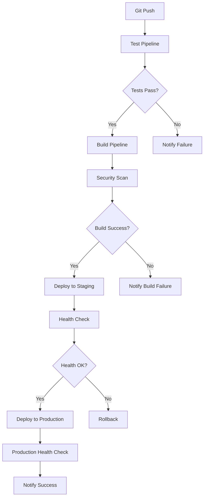

# CI/CD Documentation

## Обзор

Проект использует полностью автоматизированный CI/CD pipeline на основе GitHub Actions для обеспечения качества кода, автоматической сборки и развертывания.

## Архитектура CI/CD



## Pipelines

### 1. Test Pipeline (.github/workflows/test.yml)

**Триггеры:**
- Push в ветки: `main`, `master`, `develop`
- Pull Request в ветки: `main`, `master`, `develop`

**Этапы:**
1. **Code Linting**
   - Go: golangci-lint
   - Frontend: ESLint + TypeScript check
   
2. **Backend Tests**
   - Unit тесты с покрытием
   - PostgreSQL сервис для интеграционных тестов
   - Генерация отчетов покрытия
   
3. **Frontend Tests**
   - Unit тесты (Jest)
   - Integration тесты
   - Coverage отчеты
   
4. **E2E Tests**
   - Полный стек тестирование
   - Реальная база данных
   - API + UI тестирование
   
5. **Security Scan**
   - Trivy vulnerability scanner
   - npm audit для frontend
   - SARIF отчеты в GitHub Security

### 2. Build Pipeline (.github/workflows/build.yml)

**Триггеры:**
- Push в `main`/`master`
- Успешное завершение Test Pipeline
- Git tags `v*`

**Этапы:**
1. **Build Backend Image**
   - Multi-platform build (AMD64, ARM64)
   - Docker layer caching
   - SBOM generation
   
2. **Build Frontend Image**
   - Nginx-based production build
   - Multi-platform support
   - Security scanning
   
3. **Security Scan Images**
   - Trivy container scanning
   - Vulnerability reports
   
4. **Push to Registry**
   - GitHub Container Registry (ghcr.io)
   - Automated tagging strategy

### 3. Deploy Pipeline (.github/workflows/deploy.yml)

**Триггер:** Manual (workflow_dispatch)

**Параметры:**
- Environment: staging/production
- Backend image URL
- Frontend image URL
- Force deploy flag

**Этапы:**
1. **Pre-deployment Checks**
   - Image validation
   - Deployment tracking
   
2. **Environment-specific Deployment**
   - Staging: Direct deployment
   - Production: Rolling update + backup
   
3. **Health Checks**
   - Application availability
   - API endpoints validation
   - Smoke tests
   
4. **Post-deployment**
   - Status updates
   - Notifications (Telegram/Slack)
   - Deployment summary

## Мониторинг и Алерты

### Prometheus Metrics

**System Metrics:**
- CPU, Memory, Disk usage
- Network I/O
- Container metrics

**Application Metrics:**
- HTTP request duration
- Error rates
- Database connections
- Custom business metrics

**Infrastructure Metrics:**
- Docker container status
- PostgreSQL performance
- SSL certificate expiry

### Alert Rules

**Critical Alerts:**
- Application down
- High error rate (>5%)
- Database connection issues
- Low disk space (<10%)
- SSL certificate expiry (<7 days)

**Warning Alerts:**
- High CPU usage (>80%)
- High memory usage (>85%)
- High response time (>500ms)
- Container restarts

### Notification Channels

1. **Telegram**
   - Instant notifications
   - Critical and deployment alerts
   
2. **Email**
   - Detailed alert information
   - Weekly summaries
   
3. **Slack**
   - Team notifications
   - Integration with channels

## Secrets Management

### Required Secrets

**Docker Registry:**
- `GITHUB_TOKEN` (automatic)

**Deployment:**
- `STAGING_SSH_PRIVATE_KEY`
- `STAGING_HOST`
- `STAGING_USER`
- `PRODUCTION_SSH_PRIVATE_KEY`
- `PRODUCTION_HOST`
- `PRODUCTION_USER`

**Notifications:**
- `TELEGRAM_BOT_TOKEN`
- `TELEGRAM_CHAT_ID`
- `SLACK_WEBHOOK_URL`

**Monitoring:**
- `GRAFANA_PASSWORD`
- `SMTP_HOST`
- `SMTP_USER`
- `SMTP_PASSWORD`

## Deployment Environments

### Development
- **URL:** http://localhost:8080
- **Auto-deploy:** On feature branch push
- **Database:** Local PostgreSQL
- **Monitoring:** Basic health checks

### Staging
- **URL:** https://staging.example.com
- **Auto-deploy:** On main branch push
- **Database:** Staging PostgreSQL
- **Monitoring:** Full monitoring stack
- **SSL:** Let's Encrypt

### Production
- **URL:** https://example.com
- **Deploy:** Manual approval required
- **Database:** Production PostgreSQL with backups
- **Monitoring:** Full monitoring + alerting
- **SSL:** Production certificate
- **Backup:** Automated daily backups

## Usage Guide

### Автоматическое развертывание

1. **Разработка:**
   ```bash
   git checkout -b feature/new-feature
   # Разработка
   git push origin feature/new-feature
   # Создать PR → автоматические тесты
   ```

2. **Staging:**
   ```bash
   git checkout main
   git merge feature/new-feature
   git push origin main
   # → Автоматические тесты → Сборка → Staging
   ```

3. **Production:**
   - Перейти в GitHub Actions
   - Запустить "Deploy Pipeline"
   - Выбрать "production"
   - Указать образы для развертывания

### Ручное развертывание

```bash
# Локальная разработка
./scripts/deploy-enhanced.sh dev

# Staging с кастомными образами
./scripts/deploy-enhanced.sh staging \
  ghcr.io/user/backend:v1.0.0 \
  ghcr.io/user/frontend:v1.0.0

# Production
./scripts/deploy-enhanced.sh production \
  ghcr.io/user/backend:latest \
  ghcr.io/user/frontend:latest
```

### Мониторинг

```bash
# Запуск мониторинга
cd monitoring
docker-compose -f docker-compose.monitoring.yml up -d

# Доступ к сервисам
echo "Grafana: http://localhost:3000 (admin/admin123)"
echo "Prometheus: http://localhost:9090"
echo "AlertManager: http://localhost:9093"
echo "Uptime Kuma: http://localhost:3001"
```

## Rollback Strategy

### Автоматический Rollback
- Health check failures
- High error rates
- Critical alerts

### Ручной Rollback
```bash
# Через скрипт
./scripts/deploy-enhanced.sh production \
  ghcr.io/user/backend:previous-tag \
  ghcr.io/user/frontend:previous-tag

# Через GitHub Actions
# Запустить Deploy Pipeline с предыдущими образами
```

### Database Rollback
```bash
# Восстановление из бэкапа
docker exec -i postgres psql -U project_user -d project_manager_db < /backup/latest/database.sql
```

## Troubleshooting

### Частые проблемы

1. **Tests failing:**
   - Проверить логи в GitHub Actions
   - Запустить тесты локально
   - Проверить зависимости

2. **Build failing:**
   - Проверить Dockerfile
   - Проверить доступность базовых образов
   - Проверить secrets

3. **Deployment failing:**
   - Проверить SSH ключи
   - Проверить доступность серверов
   - Проверить Docker на серверах

4. **Health checks failing:**
   - Проверить логи приложения
   - Проверить сетевую доступность
   - Проверить конфигурацию

### Логи и отладка

```bash
# Логи приложения
docker logs backend
docker logs frontend

# Логи развертывания
tail -f /tmp/deploy-*.log

# Логи мониторинга
docker logs prometheus
docker logs grafana
docker logs alertmanager
```

## Best Practices

### Development
- Использовать feature branches
- Писать тесты для нового кода
- Следовать conventional commits
- Code review обязателен

### Security
- Регулярно обновлять зависимости
- Сканировать образы на уязвимости
- Использовать secrets для чувствительных данных
- Ротация ключей и паролей

### Monitoring
- Настроить алерты для критических метрик
- Регулярно проверять дашборды
- Анализировать тренды производительности
- Документировать инциденты

### Deployment
- Тестировать на staging перед production
- Использовать blue-green deployment для критических обновлений
- Автоматизировать rollback
- Мониторить после развертывания

## Maintenance

### Еженедельно
- Проверка алертов и метрик
- Обновление зависимостей
- Очистка старых образов и логов

### Ежемесячно
- Ротация secrets
- Обновление мониторинга
- Тестирование процедур восстановления
- Анализ производительности

### Ежеквартально
- Обновление CI/CD pipeline
- Ревью security политик
- Оптимизация ресурсов
- Документация изменений 